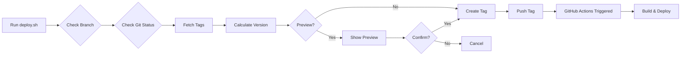

# Karma Deploy Scripts

Unified deployment scripts for all Karma services. These scripts provide a consistent deployment experience across all repositories.

## 🚀 Quick Installation

Run this command in any Karma service repository:

```bash
curl -sL https://raw.githubusercontent.com/karmadev/karma-workflows/main/scripts/install-deploy-script.sh | bash
```

This will:
1. Download the latest `deploy.sh` script
2. Create a `.deploy.config` file customized for your service
3. Add npm scripts to `package.json`
4. Create deployment documentation

## 📦 What Gets Installed

### `deploy.sh`
The main deployment script that handles:
- Version tagging (semantic versioning)
- Environment-specific deployments (dev, staging, production)
- Git tag creation and pushing
- Pre-deployment checks and validations
- Deployment previews

### `.deploy.config`
Service-specific configuration:
```bash
SERVICE_NAME="your-service"
DEFAULT_BRANCH="master"
DEPLOY_BRANCHES="master main"
VERSION_PREFIX="v"
ENABLE_HOTFIX=true
ENABLE_PREVIEW=true
```

### NPM Scripts
Automatically added to `package.json`:
```json
{
  "scripts": {
    "deploy": "bash deploy.sh",
    "deploy:dev": "bash deploy.sh dev",
    "deploy:staging": "bash deploy.sh staging",
    "deploy:prod": "bash deploy.sh prod"
  }
}
```

## 📋 Usage

### Basic Deployment

```bash
# Deploy to development
npm run deploy:dev

# Deploy to staging
npm run deploy:staging

# Deploy to production
npm run deploy:prod
```

### Advanced Options

```bash
# Specify version bump type
./deploy.sh prod --major     # 1.0.0 → 2.0.0
./deploy.sh prod --minor     # 1.0.0 → 1.1.0
./deploy.sh prod --patch     # 1.0.0 → 1.0.1 (default)

# Use specific version
./deploy.sh staging --version 2.3.1

# Add custom message
./deploy.sh prod --message "Release new payment feature"

# Preview without deploying
./deploy.sh dev --preview

# Create hotfix
./deploy.sh hotfix --message "Fix critical payment bug"
```

## 🏷️ Version Tagging Strategy

The script creates version tags that trigger GitHub Actions:

| Environment | Tag Format | Example | Description |
|------------|------------|---------|-------------|
| Production | `v{version}` | `v2.1.0` | Production release |
| Development | `v{version}-dev` | `v2.1.0-dev` | Development deployment |
| Staging | `v{version}-staging` | `v2.1.0-staging` | Staging deployment |

## 🔧 Configuration

### `.deploy.config` Options

```bash
# Basic Configuration
SERVICE_NAME="my-service"          # Service name (default: directory name)
DEFAULT_BRANCH="master"            # Default git branch
DEPLOY_BRANCHES="master main"      # Allowed deployment branches
VERSION_PREFIX="v"                 # Tag prefix
ENABLE_HOTFIX=true                # Allow hotfix deployments
ENABLE_PREVIEW=true               # Show preview before deployment

# Service-Type Specific (auto-detected)
DEPLOY_TYPE="kubernetes"          # kubernetes|firebase|cloud-function
```

### Local Overrides

Create `.deploy.config.local` for personal settings (gitignored):
```bash
ENABLE_PREVIEW=false              # Skip confirmation prompts
DEFAULT_BRANCH="develop"          # Personal branch preference
```

## 🔄 Updating Scripts

To update to the latest version:

```bash
# Re-run the installer
curl -sL https://raw.githubusercontent.com/karmadev/karma-workflows/main/scripts/install-deploy-script.sh | bash

# Or manually download
curl -sL https://raw.githubusercontent.com/karmadev/karma-workflows/main/scripts/deploy.sh -o deploy.sh
chmod +x deploy.sh
```

## 📊 Deployment Flow



## 🎯 Service Type Detection

The installer automatically detects your service type:

| Detection | Service Type | Based On |
|-----------|-------------|----------|
| Dockerfile exists | Kubernetes | `Dockerfile` present |
| Firebase config | Firebase | `firebase.json` or `.firebaserc` |
| Cloud Functions | GCP Function | `@google-cloud/functions` dependency |
| Default | Node.js | `package.json` present |

## 💡 Best Practices

1. **Always deploy from main/master branch** for production
2. **Use semantic versioning** consistently
3. **Write meaningful tag messages** for hotfixes
4. **Test in dev/staging** before production
5. **Review the preview** before confirming deployment

## 🛠️ Troubleshooting

### "Not on deployable branch" warning
- Configure `DEPLOY_BRANCHES` in `.deploy.config`
- Or use `--force` flag (not recommended)

### "Uncommitted changes" warning
- Commit or stash changes before deploying
- The script will warn but allow you to continue

### Tag already exists
- The script prevents duplicate tags
- Use `--version` with a different version number

### Script not executable
```bash
chmod +x deploy.sh
```

## 📚 Examples

### Example 1: Regular Development Flow
```bash
# Make changes
git add .
git commit -m "Add new feature"
git push

# Deploy to dev
npm run deploy:dev

# Test in dev environment
# If good, deploy to staging
npm run deploy:staging

# After QA approval
npm run deploy:prod
```

### Example 2: Hotfix Flow
```bash
# On production issue
git checkout master
git pull

# Fix the issue
git add .
git commit -m "Fix critical bug"
git push

# Deploy hotfix
./deploy.sh hotfix --message "Fix payment processing error"
```

### Example 3: Major Release
```bash
# For breaking changes
./deploy.sh prod --major --message "v2.0.0 - New API version"
```

## 🔗 Integration with CI/CD

The deploy script works seamlessly with the Karma reusable workflows:

1. Script creates version tag
2. GitHub Actions triggered by tag
3. Workflow determines environment from tag suffix
4. Build, test, and deploy automatically

## 📝 Changelog

### v2.0.0
- Added multi-environment support
- Improved version detection
- Added preview mode
- Service type auto-detection
- Configurable via `.deploy.config`

### v1.0.0
- Initial release
- Basic tagging functionality